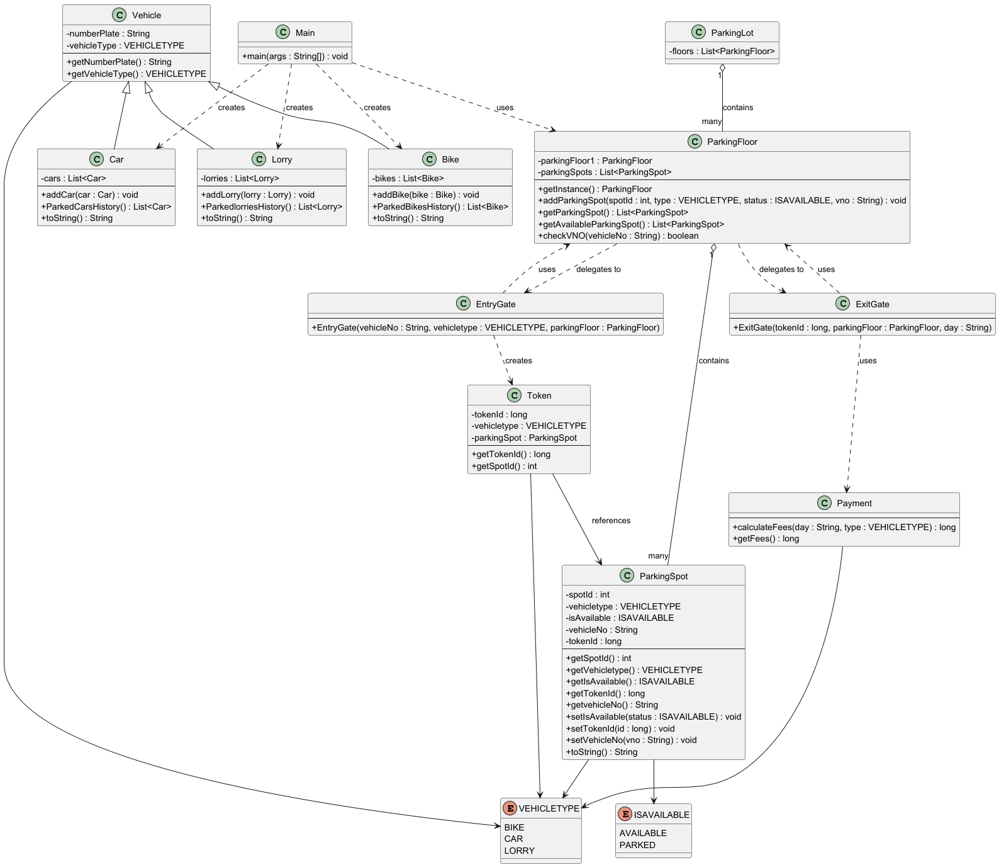

# Parking Lot Management System 🚗

A Java-based Parking Lot Management System developed to practice Object-Oriented Programming (OOP), Low Level Design (LLD), Collections Framework, and Design Patterns.

This project simulates a real-world parking lot where vehicles can be parked, removed, and tracked efficiently.

---

## Features

- Park Vehicles
- Remove Vehicles
- View Available Parking Spots
- Support for Different Vehicle Types
- Parking Spot Allocation
- Parking Availability Tracking
- Console-Based User Interaction
- Singleton Design Pattern Usage
- Collections Framework Usage
- Iterator Usage

---

## Technologies Used

- Java
- Object-Oriented Programming (OOP)
- Collections Framework
- Low Level Design (LLD)
- Design Patterns

---

## Concepts Implemented

### OOP Concepts
- Encapsulation
- Abstraction
- Inheritance
- Polymorphism

### Java Concepts
- ArrayList
- ListIterator
- Enums
- LocalDate
- Switch Case
- Exception Handling

### Design Patterns
- Singleton Design Pattern

---

# Class Diagram



## Project Structure

```text
src/
│
├── Main.java
├── Vehicle.java
├── ParkingSpot.java
├── ParkingManager.java
├── Ticket.java
├── Enum/
└── Utilities/
```

---

## Functionalities

### Vehicle Parking
- Allocates available parking spots
- Supports multiple vehicle types

### Vehicle Removal
- Removes parked vehicle
- Frees parking slot automatically

### Parking Spot Tracking
- Displays available and occupied spots
- Tracks parking status in real time

---

## Future Improvements

- Multi-floor Parking Support
- Parking Fee Calculation
- Ticket Generation
- Payment Integration
- Database Integration
- GUI Version
- Thread Safety

---

## Sample Output

```text
1. Park Vehicle
2. Remove Vehicle
3. View Available Spots
4. Exit
```

---

## Learning Outcome

This project helped me improve my understanding of:
- Java Programming
- Low Level System Design
- Real-world Object Modeling
- Collections Framework
- Design Patterns
- Clean Code Structure

---

## Author

K Sudharsana Kumar
